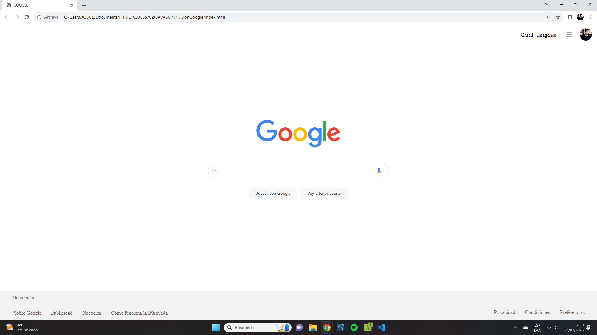

# Google Search Clone

Este es un clon del famoso buscador de Google, desarrollado por [Josue Maldonado Lepe](https://jos-mlp.github.io/). El proyecto tiene como objetivo recrear la vista básica del buscador, permitiendo a los usuarios ver una interfaz similar

## Características

-   Interfaz de búsqueda similar a Google.
-   Detalles identicos.

## Vista Previa

## Tecnologías Utilizadas

-   HTML5
-   CSS3
-   JavaScript (puedes mencionar si utilizaste alguna librería o framework específico)

## Problemas (Issues)

Si encuentras algún problema o tienes una sugerencia para mejorar este proyecto, por favor abre un issue en este repositorio. Estamos abiertos a tus ideas para hacer que este clon del buscador de Google sea aún mejor.

## Licencia

Este proyecto está bajo la Licencia [MIT]